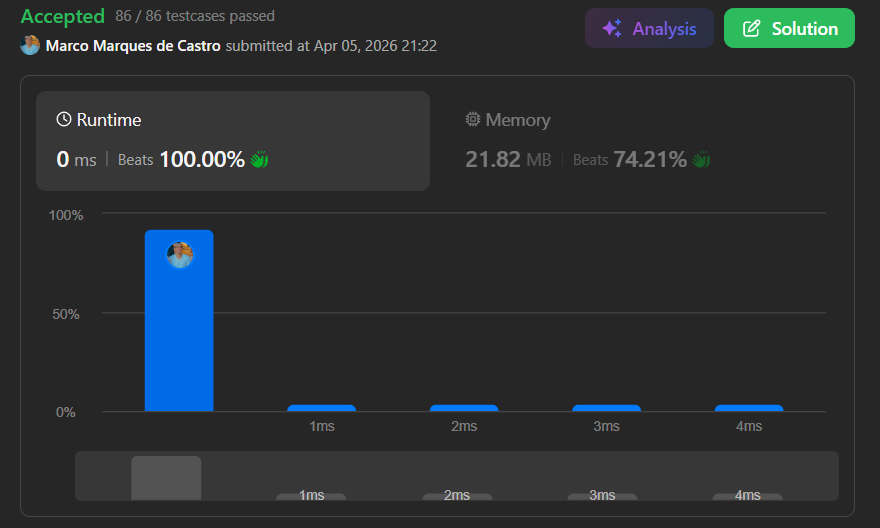
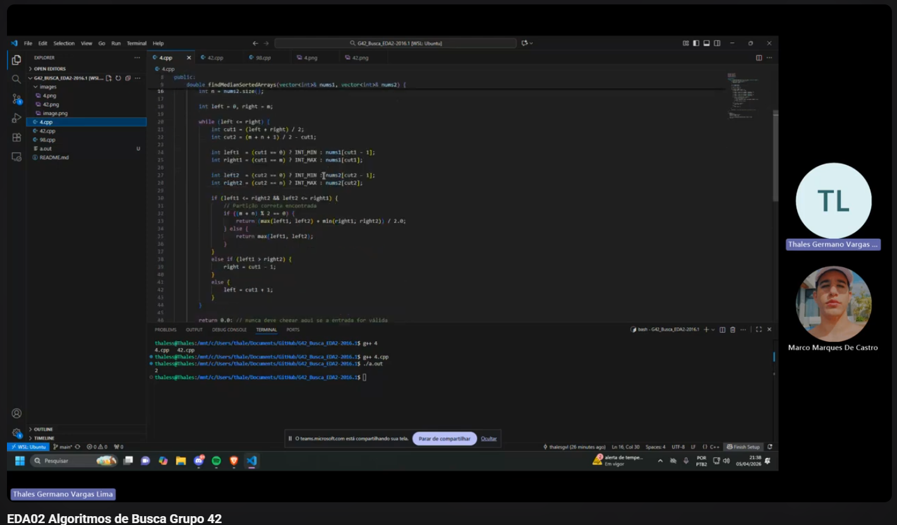

# Algoritmos de Busca

**Número da Lista:** 01  
**Disciplina:** FGA0030 - Estruturas de Dados e Algoritmos II  

## Integrantes

  
  

| Matrícula   | Aluno           |
|------------|-----------------|
| 20/2017147 | Thales Germano  |
| 21/1062197 | Marco Marques   |

## Sobre

A atividade foi baseada na resolução de desafios de programação da plataforma LeetCode.  
Foram selecionados **2 exercícios difíceis e 1 médio**, com foco em **algoritmos de busca**.

---

## Exercícios

### [4. Median of Two Sorted Arrays](https://leetcode.com/problems/median-of-two-sorted-arrays/) – Hard

Dado dois vetores ordenados, o objetivo é encontrar a mediana do conjunto formado pela união dos dois.

**Ideia**

A solução pode ser feita a partir da intercalação dos vetores em ordem, até encontrar o elemento central.  
Como ambos já estão ordenados, é possível percorrê-los comparando os elementos atuais de cada um.

**O que foi utilizado**

- Vetores
- Intercalação de arrays ordenados
- Busca da posição central
- Comparação sequencial

  

---

### [42. Trapping Rain Water](https://leetcode.com/problems/trapping-rain-water/) – Hard

Dado um vetor representando alturas de barras, o objetivo é calcular quanta água pode ficar acumulada entre elas após a chuva.

**Ideia**

Para cada posição, calcula-se a maior barra à esquerda e a maior barra à direita.  
A água armazenada naquela posição será o menor desses dois valores menos a altura atual.

**O que foi utilizado**

- Vetores auxiliares
- Varredura linear
- Máximos à esquerda e à direita
- Soma acumulada

  

---

### [98. Validate Binary Search Tree](https://leetcode.com/problems/validate-binary-search-tree/) – Medium

Dada uma árvore binária, o objetivo é verificar se ela respeita as propriedades de uma árvore binária de busca (BST).

**Ideia**

Cada nó deve estar dentro de um intervalo válido de valores.  
Na subárvore da esquerda, os valores devem ser menores que o nó atual.  
Na subárvore da direita, os valores devem ser maiores.

**O que foi utilizado**

- Árvores binárias
- Recursão
- DFS
- Controle de intervalo mínimo e máximo

  

---

## Apresentação

  

  

    Autores: 
    <a href="https://github.com/thalesgvl">Thales Germano Vargas Lima</a> & 
    <a href="https://github.com/marcomarquesdc">Marco Marques</a>
  

